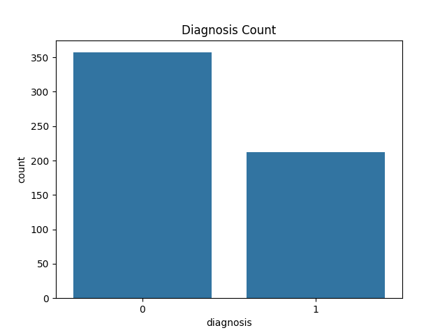
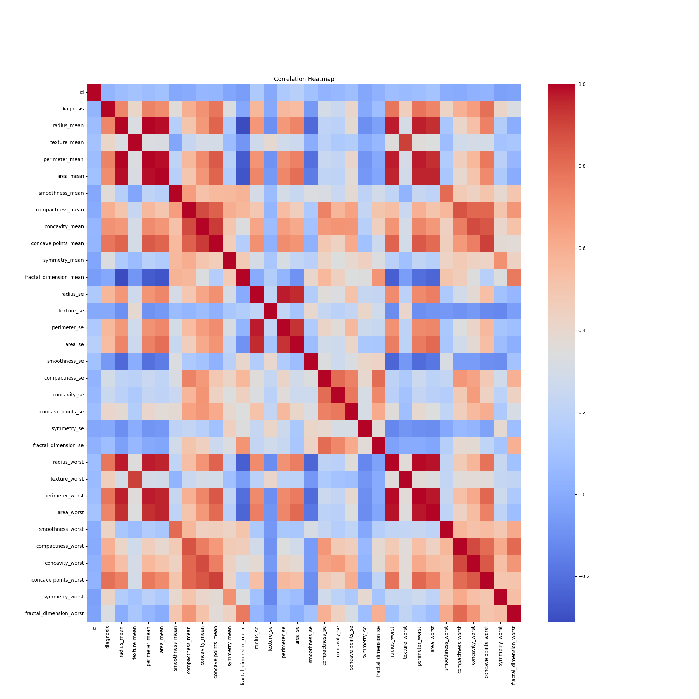
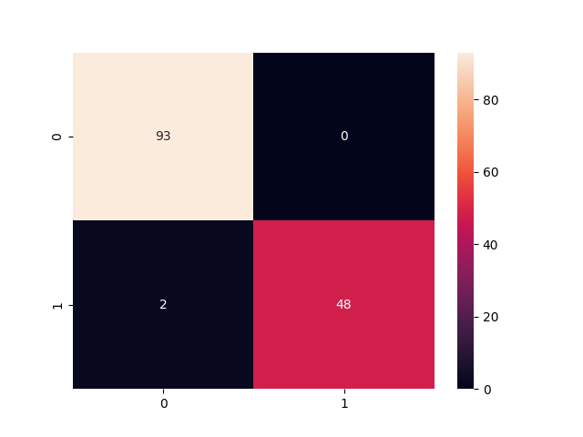
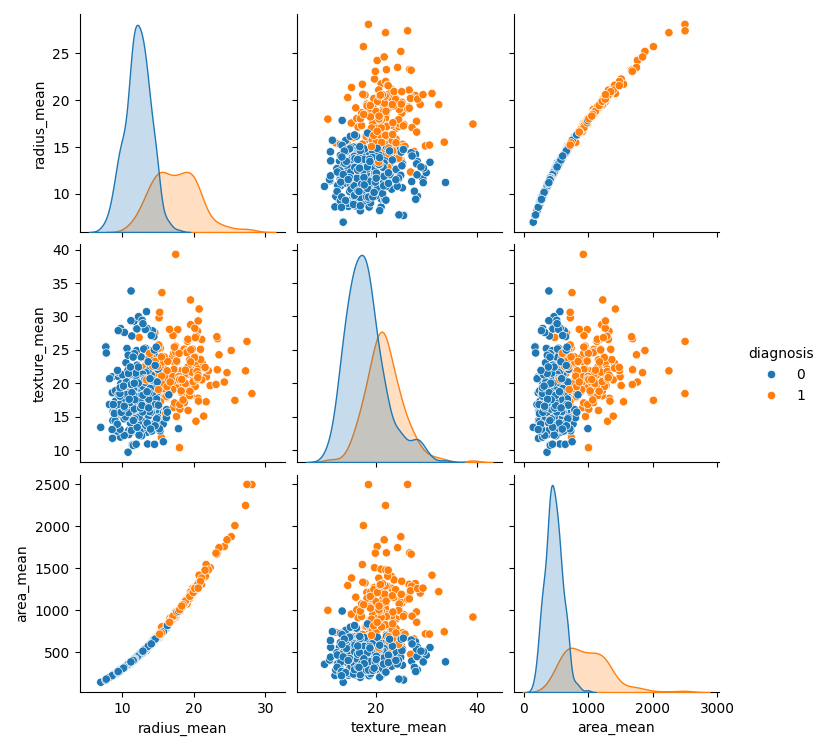

<h1 align="center">Breast Cancer Prediction using Logistic Regression</h1>

<h2>Project Overview</h2>

        This project focuses on predicting whether a breast tumor is
        <b>Benign (B)</b> or <b>Malignant (M)</b> using Machine Learning.
        The model is trained using the Breast Cancer Wisconsin Diagnostic Dataset
        and implemented with Logistic Regression.

        This project aims to demonstrate how machine learning can assist
        in early breast cancer diagnosis by analysing cell nucleus characteristics
        extracted from digitised medical images.

<h2>Problem Statement</h2>

        Breast cancer is one of the most common cancers affecting women worldwide.
        Early detection plays a major role in improving survival rates.

        This project builds a classification model that predicts:

<ul>
        <li>Benign Tumor</li>
        <li>Malignant Tumor</li>
</ul>

based on medical diagnostic features.

<h2>Dataset Information</h2>

 Dataset used:

UCI Machine Learning Repository - Breast Cancer Wisconsin (Diagnostic) Dataset

<h3>Dataset Link</h3>

<a href="https://archive.ics.uci.edu/ml/datasets/Breast+Cancer+Wisconsin+%28Diagnostic%29"
target="_blank">
Click Here to Open Dataset
</a>

<h3>Dataset Details</h3>

<ul>
        <li>Total Records: 569</li>
        <li>Benign Cases: 357</li>
        <li>Malignant Cases: 212</li>
        <li>Features: 30 numerical features</li>
        <li>Missing Values: None</li>
</ul>
<h3>Features Included</h3>

        The dataset contains features computed from Fine Needle Aspirate (FNA)
        images of breast masses.

<b>Some important features:</b>

<ul>
        <li>Radius</li>
        <li>Texture</li>
        <li>Perimeter</li>
        <li>Area</li>
        <li>Smoothness</li>
        <li>Compactness</li>
        <li>Concavity</li>
        <li>Symmetry</li>
        <li>Fractal Dimension</li>
</ul>

<b>For each feature:</b>

<ul>
        <li>Mean</li>
        <li>Standard Error</li>
        <li>Worst Value</li>
</ul>

<h2>Technologies Used</h2>
<ul>
        <li>Python</li>
        <li>Pandas</li>
        <li>NumPy</li>
        <li>Matplotlib</li>
        <li>Seaborn</li>
        <li>Scikit-learn</li>
        <li>Jupyter Notebook</li>
</ul>

<h2>Machine Learning Algorithm</h2>
<h3>Logistic Regression</h3>

        Logistic Regression is a supervised machine learning algorithm used for
        binary classification problems.

In this project:

<ul>
        <li>0 = Benign</li>
        <li>1 = Malignant</li>
</ul>

        The model predicts the probability of a tumor being malignant based on
        input features.

<h2>Project Workflow</h2>
<ol>
        <li>Import Libraries</li>
        <li>Load Dataset</li>
        <li>Data Cleaning</li>
        <li>Exploratory Data Analysis</li>
        <li>Feature Encoding</li>
        <li>Train-Test Split</li>
        <li>Feature Scaling</li>
        <li>Model Training using Logistic Regression</li>
        <li>Prediction</li>
        <li>Model Evaluation</li>
	      <li>Data Visualisation</li>
</ol>

<h2>Data Preprocessing</h2>
<h3>Handling Missing Values</h3>
<ul>
        <li>Removed unnecessary null column</li>
        <li>Removed unnecessary ID column</li>
        <li>Dataset contains no significant missing values</li>
</ul>

<h3>Label Encoding</h3>

Diagnosis values:

<ul>
        <li>M → 1</li>
        <li>B → 0</li>
</ul>
<h3>Feature Scaling</h3>

        Standardisation was applied using:

<pre>
StandardScaler()
</pre>

<h2>Data Visualizations</h2>
 <ul>
        <li>Count Plot</li>
	      
        <li>Correlation Heatmap</li>
	      
        <li>Confusion Matrix Heatmap</li>
	      
        <li>Pairplot</li>
	      
</ul>

        These visualisations help in understanding feature relationships,
        class distribution, correlations, and overall model performance.

hr>
<h2>Model Performance</h2>
<h3>Model Accuracy: 95.8%</h3>
<h3>Classification Report</h3>
<table border="1" cellpadding="10">
<tr>
<th>Metric</th>
<th>Benign</th>
<th>Malignant</th>
</tr>
<tr>
<td>Precision</td>
<td>0.95</td>
<td>0.98</td>
</tr>

<tr>
<td>Recall</td>
<td>0.99</td>
<td>0.91</td>
</tr>

<tr>
<td>F1-Score</td>
<td>0.97</td>
<td>0.94</td>
</tr>

</table>

<h2>Confusion Matrix</h2>

        The confusion matrix was visualised using a heatmap to analyse the model
        predictions and classification performance.

  

<h2>Installation</h2>
<pre>
pip install pandas numpy matplotlib seaborn scikit-learn
</pre>

<h2>How to Run</h2>
    <ol>
        <li>Download the dataset</li>
        <li>Open Jupyter Notebook</li>
        <li>Run all cells</li>
        <li>Train the Logistic Regression model</li>
        <li>View predictions and evaluation metrics</li>
    </ol>

<h2>Project Structure</h2>
<pre>
Breast-Cancer-Prediction/
│
├── data.csv
├── BreastCancer.ipynb
├── README.md
├── requirements.txt
└── images/
    </pre>

<h2>Key Learnings</h2>
<ul>
        <li>Data preprocessing and feature engineering</li>
        <li>Label Encoding</li>
        <li>Feature Scaling</li>
        <li>Logistic Regression implementation</li>
        <li>Model evaluation metrics</li>
        <li>Confusion Matrix visualization</li>
        <li>Healthcare data analysis using machine learning</li>
</ul>

<h2>Future Improvements</h2>
<ul>
<li>Hyperparameter tuning</li>
<li>Cross-validation</li>

<li>Feature selection techniques</li>
<li>
Compare Logistic Regression with advanced models:
<ul>
<li>Random Forest</li>
<li>Support Vector Machine (SVM)</li>
<li>XGBoost</li>
 </ul>
</li>
<li>Build a deployment app using Streamlit or Flask</li>
<li>Deploy the trained model on cloud platforms</li>
</ul>

<h2>Conclusion</h2>

        This project successfully demonstrates how Logistic Regression can be
        used for breast cancer classification with high accuracy.
        Machine learning models like this can support early diagnosis and assist
        healthcare professionals in decision-making.

